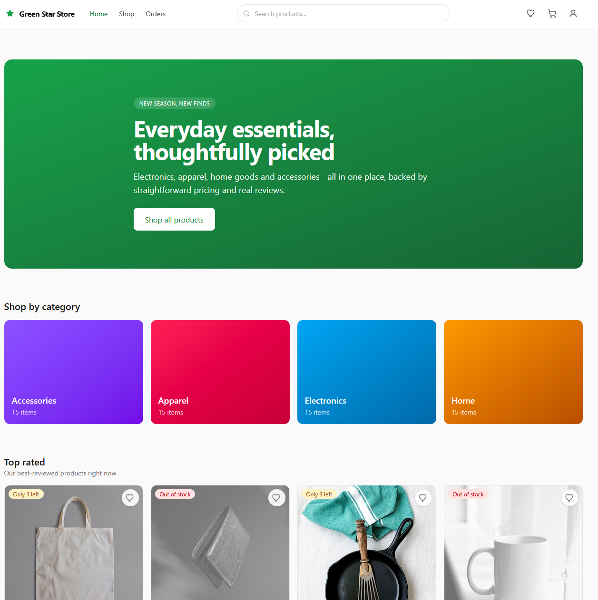
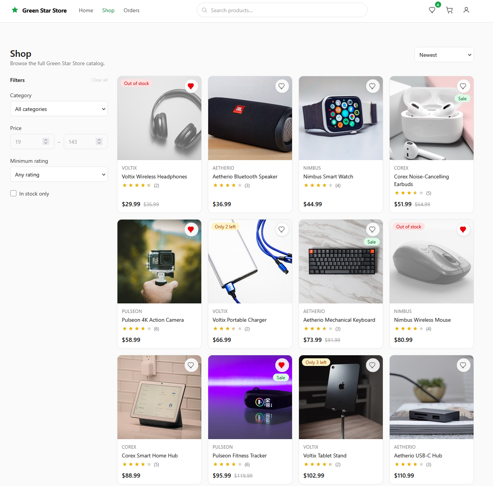
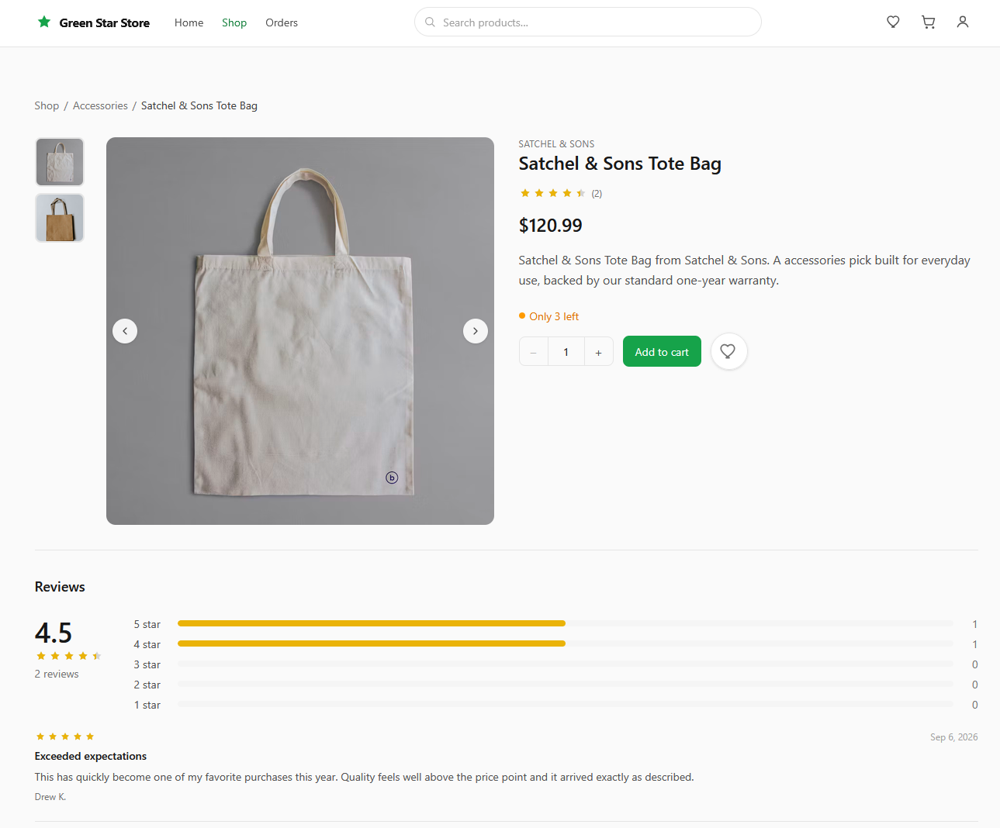
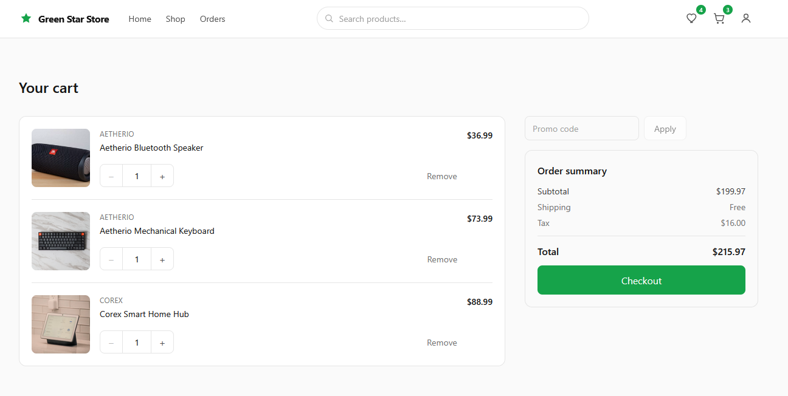
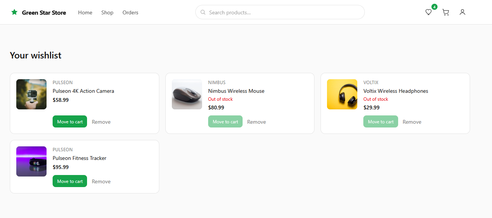
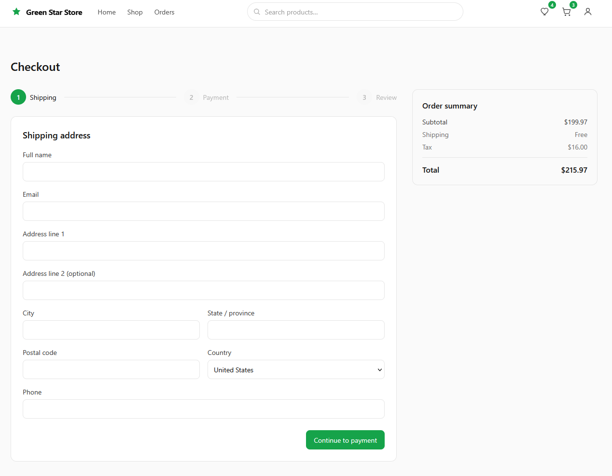
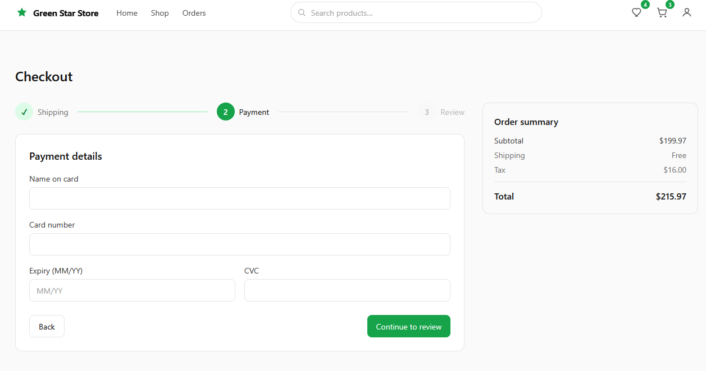
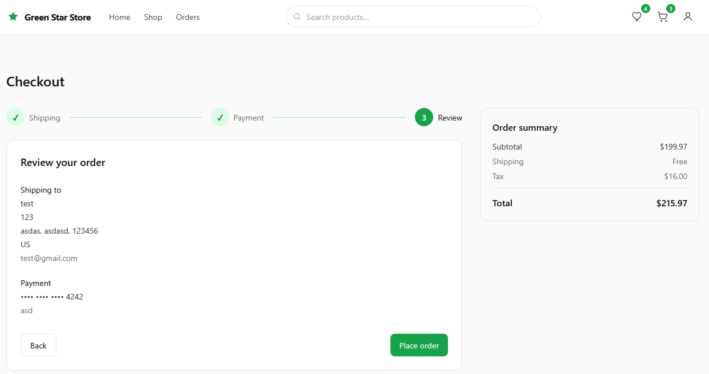
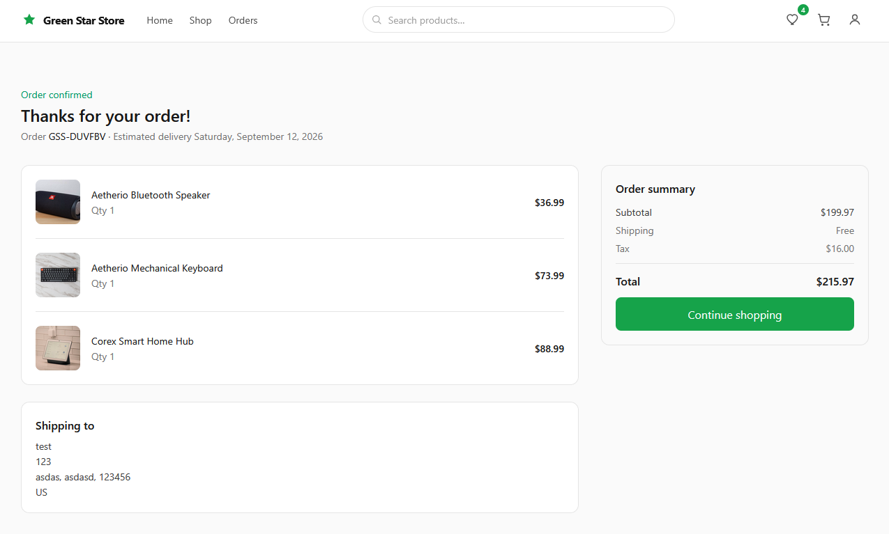
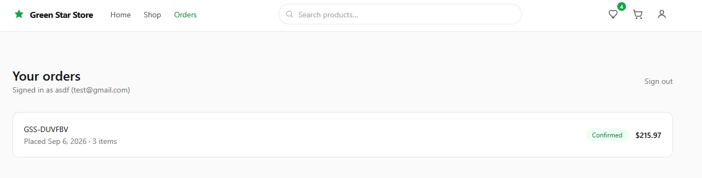

# Green Star Store

A full-featured ecommerce storefront built as a portfolio project: product catalog with search, filtering,
infinite scroll and sorting; product detail pages with image galleries and reviews; cart, wishlist and promo
codes; a multi-step checkout with validation; order confirmation and order history. All data (products,
reviews, orders) is real, seeded into Postgres and served from a small serverless API. Payments are mocked —
no real charge is ever made.

## Screenshots

### Storefront

The home page leads with a hero, category tiles, and a "Top rated" rail. Product cards surface sale
pricing, low-stock ("Only 3 left") and out-of-stock badges, and a wishlist toggle.



### Catalog

The shop page has a sidebar of filters (category, price range, minimum rating, in-stock only), a sort
control, and an infinite-scroll grid.



### Product detail

Each product has an image gallery, stock status, quantity control, add-to-cart and wishlist actions, and a
reviews section with a rating breakdown.



### Cart and wishlist

The cart supports quantity edits, line removal, promo codes, and a live order summary with subtotal,
shipping, and tax. Wishlist items can be moved to the cart individually.





### Checkout

A three-step flow — shipping, payment (mocked), then review — with a step indicator, per-step validation,
and a persistent order summary.







### Order confirmation and history

After placing an order, a confirmation page shows the order number and estimated delivery. The Orders page
lists past orders by email with status and total.





## Stack

- **Client:** Vite, React 19, TypeScript, React Router v7, Tailwind CSS v4
- **API:** Vercel serverless functions (Node) under `/api`, using `@neondatabase/serverless`
- **Database:** Neon (serverless Postgres)
- **Testing:** Vitest + React Testing Library
- **Deployment:** Vercel

## Local development

### Prerequisites

- Node.js 20+
- A Neon Postgres database (or any Postgres instance) and its connection string
- The [Vercel CLI](https://vercel.com/docs/cli) (`npm i -g vercel`), needed to run the `/api` functions locally

### Setup

```bash
npm install
cp .env.example .env.local
# edit .env.local and set DATABASE_URL to your Postgres connection string

npm run db:setup   # creates tables and seeds ~60 products, images, reviews, and promo codes
```

### Running the app

The client and the API are two separate processes locally:

```bash
vercel dev          # serves the built app + /api functions together, reads .env.local
```

or, for a faster client-only feedback loop with Vite's dev server (API calls are proxied to `vercel dev`):

```bash
vercel dev          # in one terminal, on its default port
npm run dev         # in another terminal
```

Then visit the printed local URL. `/products?limit=12` and `/api/categories` are good endpoints to sanity-check
first if something looks wrong.

## Environment variables

| Variable       | Description                                                                                                                        |
| -------------- | ---------------------------------------------------------------------------------------------------------------------------------- |
| `DATABASE_URL` | Postgres connection string (Neon). Never commit a real value — `.env.example` holds a placeholder, and `.env.local` is gitignored. |

## Scripts

- `npm run dev` — start the Vite dev server
- `npm run build` — type-check (`tsc -b`) and build for production
- `npm run preview` — preview the production build locally
- `npm run lint` — lint the codebase
- `npm run format` / `npm run format:check` — format / check formatting with Prettier
- `npm test` — run the test suite once; `npm run test:watch` for watch mode; `npm run test:coverage` for coverage
- `npm run db:setup` — create the schema and seed the database (destructive — drops and recreates tables)

## Deploying to Vercel

1. Push this repo to GitHub and import it in the [Vercel dashboard](https://vercel.com/new), or run `vercel`
   from the project root.
2. Set the `DATABASE_URL` environment variable in the Vercel project settings (Production and Preview) to your
   Neon connection string.
3. Deploy. Vercel builds the Vite app and deploys the `/api` directory as serverless functions automatically;
   `vercel.json` rewrites all non-API routes to `index.html` so client-side routing works on refresh/deep links.
4. Run `npm run db:setup` locally (pointed at the same Neon database) once before or after the first deploy to
   seed data — the app expects the schema to already exist.

## Testing notes

Tests cover pure logic (totals math, validation, cursor encoding, URL filter state, cart/wishlist reducers),
key components (product card, filters, search suggestions, quantity controls, step indicator, empty states),
and the API's query-building helpers. The database is never touched in CI — API logic is tested as pure
functions against a mocked `_db` module.
